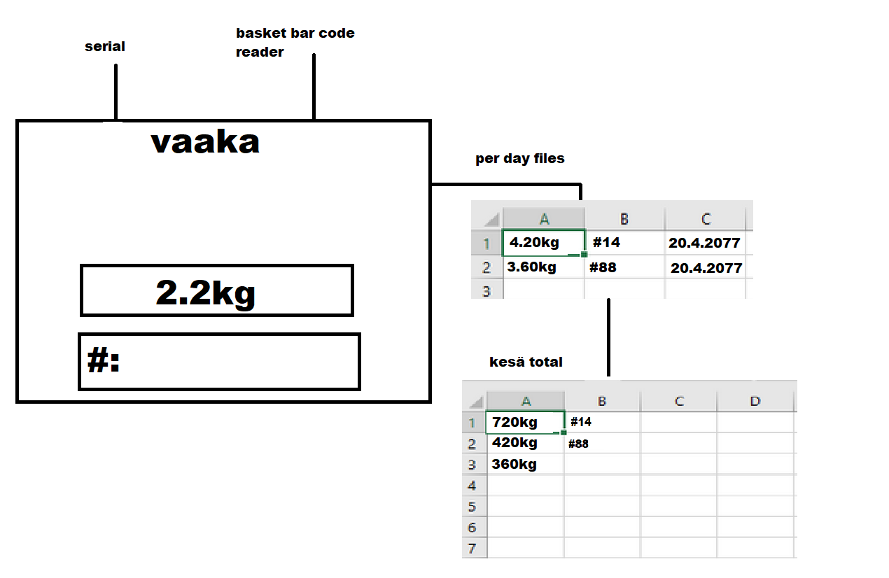

# Scale-inator
Perniöhedelmä palkkalaskuri
best MS-paint art:

# notes

core:
- input data from serial (vaaka).
- read koppa barcode with scanner.
- koppas 1-5 to kerääjä1, 5-10 to kerääjä2.
- Collectors have # of baskets. baskets have ID from 0-x.
- log both kg and kerääjä to excel in different columns.
- log summer TOTAL KG of berry collectors (excel).
- web storage backup.

Files:
mansikka.py main
GUI.py GUI
data.py csv / data storage  if need alot of code

# Needs Fixing:
BARCODE END WITH EOL / LINEBREAK P SYMBOL TO GET AUTOMATIC ENTER ON READ:
https://www.zebra.com/us/en/support-downloads/knowledge-articles/evm/how-do-i-enable-a-carriage-return-line-feed-enter-key-suffix-after-every-scan-with-the-laser-scanners-when-attached-via-usb-or-keyboard-wedge.html
at end of id, add enter

-ID input requires Enter press
- kg analytics and data simplifications needed.
- day / summer
